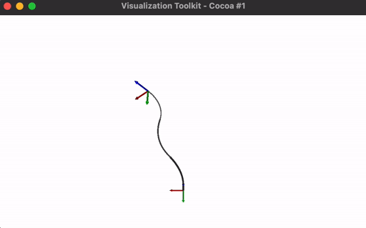

# Kinematic Modeling of a Concentric Tube Continuum Robot

This project implement Kinematic Model for Concentric Tube Continuum Robots(CTCR) from Prof. Jessica Burgner-Kahrs's course CSC476/2606 - Introduction to Continuum Robotics at UofT.

## Execution
```
mkdir build
cd build
cmake .. -DCMAKE_BUILD_TYPE=Release
make
./csc476-simulation-framework a3
```

